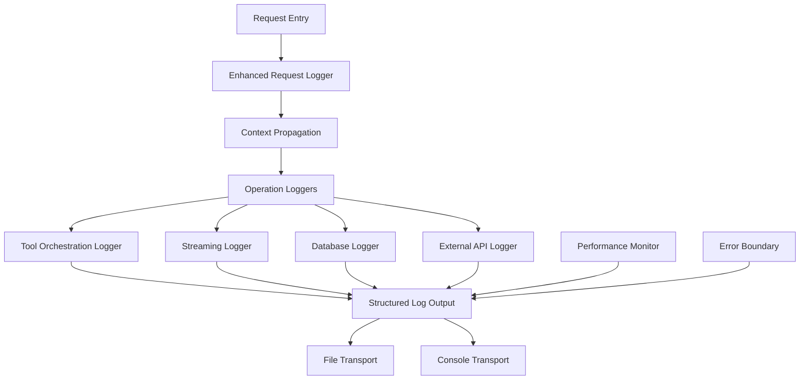

# Logging System Improvements Design

## Overview

This design enhances the existing Pino-based logging system in ChatForge to provide comprehensive observability, consistent error tracking, and improved debugging capabilities. The design maintains backward compatibility while introducing standardized logging patterns, enhanced context propagation, and specialized logging for complex operations like tool orchestration and streaming.

## Architecture

### Current State Analysis

**Strengths:**
- Pino logger with structured JSON output
- Daily rotating file transport
- Request correlation via x-request-id
- Basic sensitive data redaction
- Environment-based configuration

**Issues to Address:**
- Inconsistent use of console.* vs logger methods
- Missing context in error logs
- Limited tool orchestration visibility
- Inadequate streaming operation logging
- No performance monitoring
- Inconsistent error handling patterns

### Proposed Architecture



## Components and Interfaces

### 1. Enhanced Logger Configuration

**File:** `backend/src/logger.js`

```javascript
// Enhanced logger with additional transports and context
export const logger = pino({
  level: getLogLevel(),
  transport: {
    targets: [
      // File transport with enhanced rotation
      {
        target: './lib/enhancedFileTransport.js',
        level: 'debug',
        options: {
          file: './logs/app',
          extension: '.log',
          maxFiles: 30,
          maxSize: '100MB'
        }
      },
      // Console transport with environment optimization
      getConsoleTransport(),
      // Optional: Metrics transport for monitoring integration
      ...(config.monitoring.enabled ? [getMetricsTransport()] : [])
    ]
  },
  redact: {
    paths: [
      // Enhanced redaction patterns
      'req.headers.authorization',
      'headers.authorization',
      'config.*.apiKey',
      'body.apiKey',
      'args.apiKey',
      'toolArgs.*.key',
      'toolArgs.*.password',
      'messages[*].content' // Conditional redaction for sensitive content
    ],
    remove: true
  },
  // Enhanced serializers for complex objects
  serializers: {
    req: reqSerializer,
    res: resSerializer,
    err: errSerializer,
    tool: toolSerializer,
    stream: streamSerializer
  }
});
```

### 2. Context Propagation System

**File:** `backend/src/lib/loggingContext.js`

```javascript
// Async context tracking for request correlation
export class LoggingContext {
  constructor(initialContext = {}) {
    this.context = new Map(Object.entries(initialContext));
  }
  
  static create(req) {
    return new LoggingContext({
      requestId: req.id,
      sessionId: req.sessionId,
      userId: req.user?.id,
      method: req.method,
      url: req.url,
      timestamp: Date.now()
    });
  }
  
  child(additionalContext) {
    const childContext = new LoggingContext();
    childContext.context = new Map([...this.context, ...Object.entries(additionalContext)]);
    return childContext;
  }
  
  toObject() {
    return Object.fromEntries(this.context);
  }
}

// Context-aware logger wrapper
export class ContextualLogger {
  constructor(baseLogger, context) {
    this.logger = baseLogger;
    this.context = context;
  }
  
  info(obj, msg) {
    this.logger.info({ ...this.context.toObject(), ...obj }, msg);
  }
  
  error(obj, msg) {
    this.logger.error({ ...this.context.toObject(), ...obj }, msg);
  }
  
  // ... other log levels
}
```

### 3. Specialized Operation Loggers

#### Tool Orchestration Logger

**File:** `backend/src/lib/logging/toolLogger.js`

```javascript
export class ToolLogger {
  constructor(contextualLogger) {
    this.logger = contextualLogger;
  }
  
  logToolStart(toolName, args, iteration = 0) {
    this.logger.info({
      msg: 'tool:start',
      tool: {
        name: toolName,
        args: this.sanitizeToolArgs(args),
        iteration,
        startTime: Date.now()
      }
    });
  }
  
  logToolComplete(toolName, result, duration, iteration = 0) {
    this.logger.info({
      msg: 'tool:complete',
      tool: {
        name: toolName,
        success: !result.error,
        duration,
        iteration,
        resultSize: this.getResultSize(result)
      }
    });
  }
  
  logToolError(toolName, error, args, iteration = 0) {
    this.logger.error({
      msg: 'tool:error',
      tool: {
        name: toolName,
        args: this.sanitizeToolArgs(args),
        iteration,
        error: {
          message: error.message,
          stack: error.stack,
          type: error.constructor.name
        }
      }
    });
  }
  
  logOrchestrationFlow(step, context) {
    this.logger.debug({
      msg: 'orchestration:step',
      orchestration: {
        step,
        totalSteps: context.totalSteps,
        toolsRemaining: context.toolsRemaining,
        iterationCount: context.iterationCount
      }
    });
  }
}
```

#### Streaming Logger

**File:** `backend/src/lib/logging/streamLogger.js`

```javascript
export class StreamLogger {
  constructor(contextualLogger) {
    this.logger = contextualLogger;
  }
  
  logStreamStart(streamType, clientInfo) {
    this.logger.info({
      msg: 'stream:start',
      stream: {
        type: streamType,
        clientIp: clientInfo.ip,
        userAgent: clientInfo.userAgent,
        startTime: Date.now()
      }
    });
  }
  
  logStreamChunk(chunkInfo) {
    this.logger.debug({
      msg: 'stream:chunk',
      stream: {
        chunkSize: chunkInfo.size,
        totalBytes: chunkInfo.totalBytes,
        chunkCount: chunkInfo.count
      }
    });
  }
  
  logStreamError(error, streamState) {
    this.logger.error({
      msg: 'stream:error',
      stream: {
        state: streamState,
        bytesTransferred: streamState.bytesTransferred,
        duration: Date.now() - streamState.startTime,
        error: {
          message: error.message,
          code: error.code,
          stack: error.stack
        }
      }
    });
  }
  
  logStreamComplete(streamState) {
    this.logger.info({
      msg: 'stream:complete',
      stream: {
        totalBytes: streamState.totalBytes,
        duration: Date.now() - streamState.startTime,
        chunkCount: streamState.chunkCount,
        success: true
      }
    });
  }
}
```

### 4. Performance Monitoring

**File:** `backend/src/lib/logging/performanceLogger.js`

```javascript
export class PerformanceLogger {
  constructor(contextualLogger) {
    this.logger = contextualLogger;
    this.thresholds = {
      dbQuery: 1000,      // 1 second
      externalApi: 5000,  // 5 seconds
      toolExecution: 3000, // 3 seconds
      streamOperation: 2000 // 2 seconds
    };
  }
  
  measureOperation(operationType, operation, context = {}) {
    const startTime = process.hrtime.bigint();
    const startTimestamp = Date.now();
    
    const logStart = () => {
      this.logger.debug({
        msg: 'performance:start',
        operation: {
          type: operationType,
          startTime: startTimestamp,
          ...context
        }
      });
    };
    
    const logEnd = (result, error = null) => {
      const endTime = process.hrtime.bigint();
      const duration = Number(endTime - startTime) / 1e6; // Convert to milliseconds
      
      const logLevel = duration > this.thresholds[operationType] ? 'warn' : 'debug';
      const logData = {
        msg: error ? 'performance:error' : 'performance:complete',
        operation: {
          type: operationType,
          duration,
          success: !error,
          threshold: this.thresholds[operationType],
          slow: duration > this.thresholds[operationType],
          ...context
        }
      };
      
      if (error) {
        logData.error = {
          message: error.message,
          stack: error.stack
        };
      }
      
      this.logger[logLevel](logData);
      return result;
    };
    
    logStart();
    
    try {
      if (typeof operation === 'function') {
        const result = operation();
        if (result && typeof result.then === 'function') {
          // Handle promises
          return result
            .then(res => logEnd(res))
            .catch(err => {
              logEnd(null, err);
              throw err;
            });
        } else {
          // Handle synchronous operations
          return logEnd(result);
        }
      }
    } catch (error) {
      logEnd(null, error);
      throw error;
    }
  }
}
```

### 5. Enhanced Error Boundaries

**File:** `backend/src/lib/logging/errorBoundary.js`

```javascript
export class ErrorBoundary {
  constructor(contextualLogger) {
    this.logger = contextualLogger;
  }
  
  wrap(operation, operationName, context = {}) {
    return async (...args) => {
      try {
        this.logger.debug({
          msg: 'operation:start',
          operation: {
            name: operationName,
            ...context
          }
        });
        
        const result = await operation(...args);
        
        this.logger.debug({
          msg: 'operation:success',
          operation: {
            name: operationName,
            ...context
          }
        });
        
        return result;
      } catch (error) {
        this.logger.error({
          msg: 'operation:error',
          operation: {
            name: operationName,
            ...context
          },
          error: {
            message: error.message,
            stack: error.stack,
            name: error.name,
            code: error.code
          },
          args: this.sanitizeArgs(args)
        });
        
        throw error;
      }
    };
  }
  
  sanitizeArgs(args) {
    // Remove sensitive data from arguments
    return args.map(arg => {
      if (typeof arg === 'object' && arg !== null) {
        const sanitized = { ...arg };
        delete sanitized.password;
        delete sanitized.apiKey;
        delete sanitized.token;
        return sanitized;
      }
      return arg;
    });
  }
}
```

## Data Models

### Log Entry Structure

```typescript
interface LogEntry {
  level: number;
  time: number;
  pid: number;
  hostname: string;
  msg: string;
  
  // Request context (when available)
  req?: {
    id: string;
    method: string;
    url: string;
    sessionId?: string;
    userId?: string;
    body?: any; // Only for errors, sanitized
  };
  
  // Response context (when available)
  res?: {
    statusCode: number;
    contentLength?: string;
    body?: any; // Only for errors
  };
  
  // Operation context
  operation?: {
    type: string;
    name: string;
    duration?: number;
    success?: boolean;
    startTime?: number;
  };
  
  // Tool-specific context
  tool?: {
    name: string;
    args?: any; // Sanitized
    iteration?: number;
    duration?: number;
    success?: boolean;
    resultSize?: number;
  };
  
  // Stream-specific context
  stream?: {
    type: string;
    state?: string;
    bytesTransferred?: number;
    chunkCount?: number;
    duration?: number;
  };
  
  // Error context
  error?: {
    message: string;
    stack?: string;
    name?: string;
    code?: string | number;
  };
  
  // Performance metrics
  performance?: {
    threshold?: number;
    slow?: boolean;
    memoryUsage?: NodeJS.MemoryUsage;
  };
}
```

## Error Handling

### Centralized Error Processing

```javascript
// Enhanced error middleware
export function enhancedErrorLogger(err, req, res, next) {
  const context = LoggingContext.fromRequest(req);
  const logger = new ContextualLogger(baseLogger, context);
  
  logger.error({
    msg: 'request:error',
    error: {
      message: err.message,
      stack: err.stack,
      name: err.name,
      code: err.code,
      statusCode: err.statusCode || 500
    },
    req: {
      body: sanitizeRequestBody(req.body),
      headers: sanitizeHeaders(req.headers),
      params: req.params,
      query: req.query
    },
    errorCategory: categorizeError(err),
    severity: getSeverityLevel(err)
  });
  
  next(err);
}

function categorizeError(error) {
  if (error.name === 'ValidationError') return 'validation';
  if (error.code === 'ECONNREFUSED') return 'external_service';
  if (error.message.includes('timeout')) return 'timeout';
  if (error.statusCode >= 400 && error.statusCode < 500) return 'client_error';
  if (error.statusCode >= 500) return 'server_error';
  return 'unknown';
}
```

## Testing Strategy

### Unit Tests

1. **Logger Configuration Tests**
   - Verify correct transport setup
   - Test redaction patterns
   - Validate serializer behavior

2. **Context Propagation Tests**
   - Test context creation and inheritance
   - Verify async context preservation
   - Test context sanitization

3. **Specialized Logger Tests**
   - Tool logger output validation
   - Stream logger state tracking
   - Performance logger threshold detection

### Integration Tests

1. **End-to-End Request Logging**
   - Full request lifecycle logging
   - Error scenario logging
   - Context correlation across components

2. **Tool Orchestration Logging**
   - Multi-step tool execution logging
   - Error propagation in tool chains
   - Performance measurement accuracy

3. **Streaming Operation Logging**
   - Stream lifecycle events
   - Error handling in streams
   - Client disconnection scenarios

### Performance Tests

1. **Logging Overhead**
   - Measure logging performance impact
   - Test high-volume logging scenarios
   - Validate log rotation performance

2. **Memory Usage**
   - Monitor logger memory consumption
   - Test context object lifecycle
   - Validate cleanup procedures

## Implementation Phases

### Phase 1: Foundation (Week 1)
- Enhanced logger configuration
- Context propagation system
- Basic specialized loggers

### Phase 2: Integration (Week 2)
- Replace console.* usage
- Implement error boundaries
- Add performance monitoring

### Phase 3: Optimization (Week 3)
- Fine-tune log levels
- Implement sampling for high-frequency logs
- Add monitoring integration hooks

### Phase 4: Testing & Documentation (Week 4)
- Comprehensive test suite
- Performance validation
- Documentation and guidelines