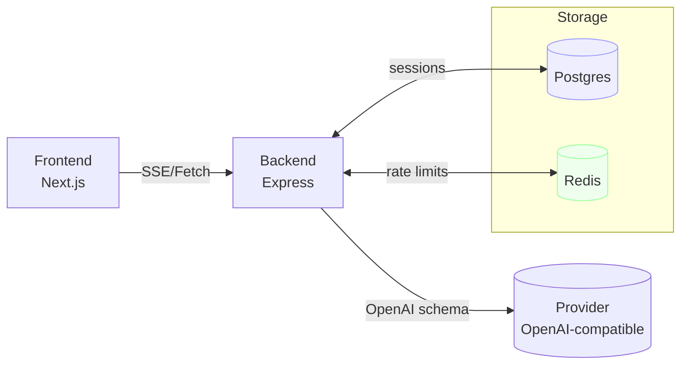

# Overview

## Vision
Zero-friction chat UI with pluggable models via an OpenAI-compatible API.

## Scope
- Frontend (MVP in progress): Next.js/React chat UI with streaming (done), basic history (pending), attachments (phase 2).
- Backend: Node/Express proxy with rate-limit (MVP in-memory done), provider routing (single provider now), auth (future phase).

## Milestones & Status
1. MVP (text-only, one model, no auth, streaming) – IN PROGRESS (UI + streaming working)
2. Multi-model routing + system prompts – NOT STARTED (model selector UI present, backend static)
3. Auth + usage limits (per-user) – NOT STARTED (IP limit only)
4. File uploads + tool calls (function calling) – NOT STARTED
5. Observability + billing hooks – NOT STARTED

## Architecture (draft)

