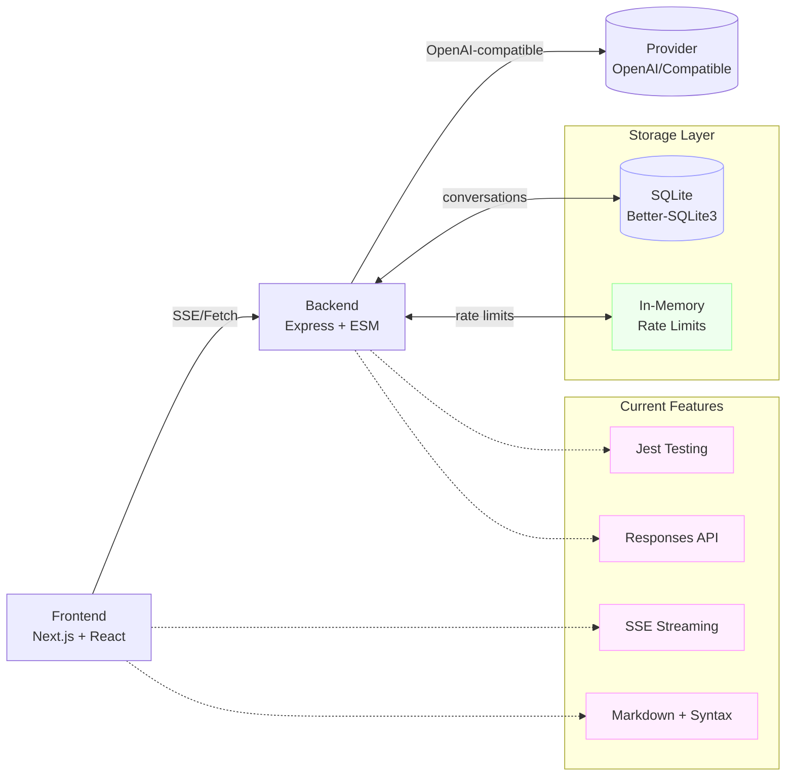

# Overview

## Vision
Zero-friction chat UI with pluggable models via an OpenAI-compatible API.

## Scope
- Frontend: Next.js/React chat UI with streaming (✅ done), Markdown rendering (✅ done), model selection UI (✅ done), basic history (pending), attachments (future phase).
- Backend: Node/Express OpenAI-compatible proxy with rate-limit (✅ in-memory done), Responses API support (✅ done), testing infrastructure (✅ done), provider routing (single provider), auth (future phase).

## Milestones & Status
1. MVP (text-only, streaming, OpenAI-compatible) – ✅ COMPLETE
2. Testing & Development Infrastructure – ✅ COMPLETE (Jest, ESLint, Docker dev environment)
3. Conversation Persistence (SQLite/Postgres) – 🚧 IN PROGRESS
4. Multi-model routing + system prompts – ⏳ PLANNED (model selector UI ready, backend static)
5. Auth + usage limits (per-user) – ⏳ PLANNED (IP limit only currently)
6. File uploads + tool calls (function calling) – ⏳ PLANNED
7. Observability + billing hooks – ⏳ PLANNED

## Architecture (current)

**Current Implementation:**
- Frontend: Next.js 15 + React 19 with Tailwind CSS
- Backend: Node.js 20 + Express with ESM modules
- Database: SQLite with better-sqlite3 (Postgres planned)
- Rate Limiting: In-memory per-IP (Redis planned)
- Testing: Jest for both frontend and backend
- Development: Docker Compose with hot reload
