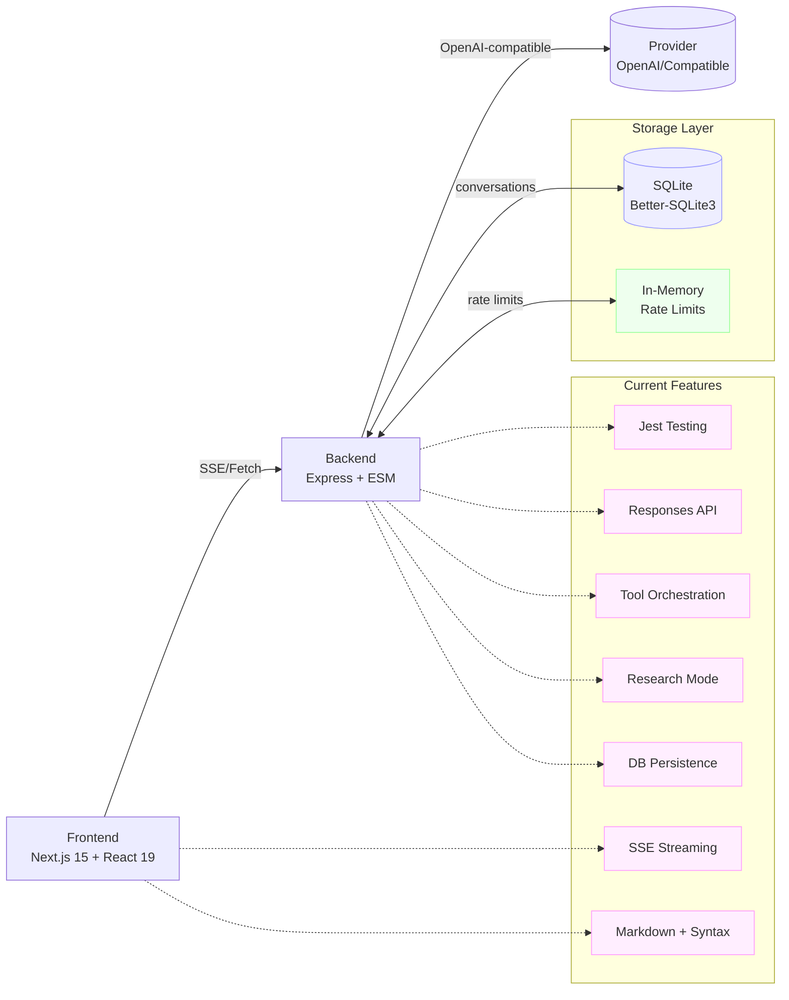

# Overview

## Vision
Zero-friction chat UI with pluggable models via an OpenAI-compatible API.

## Scope
- Frontend: Next.js/React chat UI with streaming (✅ done), Markdown rendering (✅ done), model selection UI (✅ done), enhanced UI components (✅ done), conversation persistence (🚧 in progress), attachments (future phase).
- Backend: Node/Express OpenAI-compatible proxy with rate-limit (✅ in-memory done), Responses API support (✅ done), testing infrastructure (✅ done), tool orchestration system (✅ done), database persistence (✅ done), multi-provider routing (single provider), auth (future phase).

## Milestones & Status
1. MVP (text-only, streaming, OpenAI-compatible) – ✅ COMPLETE
2. Testing & Development Infrastructure – ✅ COMPLETE (Jest, ESLint, Docker dev environment)
3. Tool Orchestration System – ✅ COMPLETE (server-side tools, iterative workflows, research mode)
4. Enhanced UI Components – ✅ COMPLETE (quality controls, floating UI positioning, accessibility)
5. Database Persistence (SQLite/Postgres) – ✅ COMPLETE (SQLite with migrations)
6. Multi-model routing + system prompts – ⏳ PLANNED (model selector UI ready, backend static)
7. Auth + usage limits (per-user) – ⏳ PLANNED (IP limit only currently)
8. File uploads + attachments – ⏳ PLANNED
9. Observability + billing hooks – ⏳ PLANNED

## Architecture (current)

**Current Implementation:**
- Frontend: Next.js 15 + React 19 with Tailwind CSS 4
- Backend: Node.js 20 + Express 5 with ESM modules
- Database: SQLite with better-sqlite3 (migrations implemented)
- Rate Limiting: In-memory per-IP (Redis planned)
- Testing: Jest for both frontend and backend
- Development: Docker Compose with hot reload
- Tool System: Server-side orchestration with get_time, web_search tools
- UI Components: Enhanced quality controls, floating UI positioning
- Persistence: Full conversation history with SQLite

## Related docs
- API specifications: see `docs/API-SPECS.md` for detailed endpoint documentation with tool calling and research mode
- Technology stack: see `docs/TECH-STACK.md` for current dependencies and infrastructure details
- Security considerations: see `docs/SECURITY.md` for environment setup and data handling guidelines
- Development progress: see `docs/PROGRESS.md` for detailed development timeline and current status